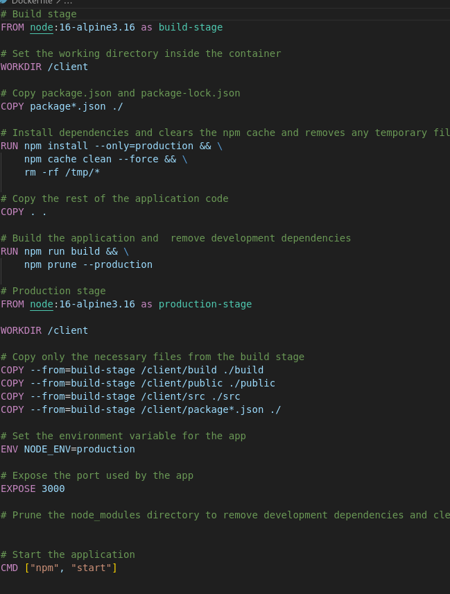

## 1. Choice of Base Image
 The base image used to build the containers is `node:16-alpine3.16`. This image is derived from the Alpine Linux distribution, making it lightweight and compact. Additionally, it includes Node.js version 16, which exceeds the version required by the application.

## 2. Dockerfile directives used in the creation and running of each container.
 I used two Dockerfiles. One for the Client and the other one for the Backend.

 **Client Dockerfile**
 

