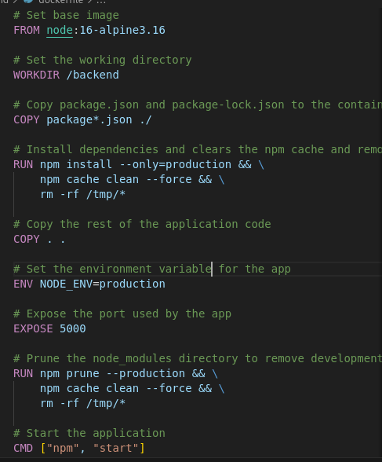

## 1. Choice of Base Image
 The base image used to build the containers is `node:16-alpine3.16`. This image is derived from the Alpine Linux distribution, making it lightweight and compact. Additionally, it includes Node.js version 16, which exceeds the version required by the application.

## 2. Dockerfile directives used in the creation and running of each container.
 I used two Dockerfiles. One for the Client and the other one for the Backend.

**Client Dockerfile**

```
# Build stage
FROM node:16-alpine3.16 as build-stage

# Set the working directory inside the container
WORKDIR /client

# Copy package.json and package-lock.json
COPY package*.json ./

# Install dependencies and clears the npm cache and removes any temporary files
RUN npm install --only=production && \
    npm cache clean --force && \
    rm -rf /tmp/*

# Copy the rest of the application code
COPY . .

# Build the application and  remove development dependencies
RUN npm run build && \
    npm prune --production

# Production stage
FROM node:16-alpine3.16 as production-stage

WORKDIR /client

# Copy only the necessary files from the build stage
COPY --from=build-stage /client/build ./build
COPY --from=build-stage /client/public ./public
COPY --from=build-stage /client/src ./src
COPY --from=build-stage /client/package*.json ./

# Set the environment variable for the app
ENV NODE_ENV=production

# Expose the port used by the app
EXPOSE 3000

# Prune the node_modules directory to remove development dependencies and clears the npm cache and removes any temporary files


# Start the application
CMD ["npm", "start"]

```


**Backend Dockerfile**


